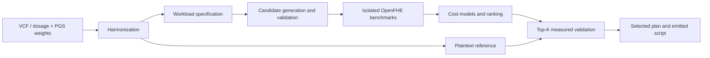

# AutoHE-PRS

**암호화된 다유전자 위험점수 계산을 위한 데이터 정합성 검사와 실행계획 자동 최적화**

> Constraint-aware execution-plan tuning for homomorphic polygenic risk-score computation.

AutoHE-PRS는 VCF와 PGS scoring file을 입력받아 effect allele 기준의 계산 행렬을 구성하고, CKKS/BFV/BGV 실행계획을 검증·측정·선택하는 연구 프로토타입이다. 예측한 비용이 낮다는 이유만으로 계획을 확정하지 않고, 선택 후보를 실제 backend에서 검증한 뒤 실행 가능한 코드를 생성한다.

| 항목 | 내용 |
|---|---|
| 계산 대상 | Polygenic risk score, PRS |
| 핵심 문제 | Allele 정합성, 암호 파라미터 제약, 정확도와 실행 비용의 균형 |
| 암호 backend | OpenFHE 후보 계획; 별도 역사적 TenSEAL pilot |
| 주요 기술 | Python, VCF/PGS parsing, homomorphic encryption, cost modeling, search |
| 출력 | 정합화 데이터, benchmark record, 후보 순위, 검증된 계획과 실행 스크립트 |

## 1. 문제 정의

PRS는 effect-allele dosage와 effect weight의 가중합으로 계산할 수 있다. 계산식 자체보다 어려운 부분은 실제 데이터의 allele 방향을 맞추고, 암호화 이후 허용되는 수치 오차·메모리·보안 파라미터 안에서 계산을 수행하는 것이다.

동일한 계산이라도 scheme, ring dimension, packing, chunk 크기, reduction 순서와 scale에 따라 실행 시간이 달라진다. 빠른 계획이 오차 조건을 위반하거나 backend에서 거부될 수도 있다. 이 프로젝트는 데이터 처리와 암호계획 선택을 하나의 검증 가능한 흐름으로 연결한다.

## 2. 전체 파이프라인



검증은 여러 지점에서 수행한다. Frontend는 입력과 allele 방향을 검사하고, deterministic validator는 불가능한 계획을 거른다. 실제 backend 실행에서는 context 생성, 복호화 가능 여부, 수치 오차와 자원 사용량을 확인한다. 최종 선택은 측정 결과에 근거한다.

## 3. 단계별 기능

| 단계 | 구현 내용 |
|---|---|
| Harmonization | VCF GT/DS 처리, PGS parsing, REF/ALT 방향 정합화, missing-data policy |
| Plaintext reference | 동일 입력의 PRS 기준값과 오차 비교 기준 생성 |
| Plan generation | Scheme·packing·chunk·reduction 등의 후보 조합 구성 |
| Static validation | 연산·파라미터·정밀도 관련 제약 사전 검사 |
| Benchmark | 독립 프로세스 실행, 반복 계측, 실패 상태 보존 |
| Cost modeling | 기록된 실행 자료를 이용한 비용 학습과 일반화 평가 |
| Search and ranking | 후보 순위화, baseline search, Pareto 분석 |
| Final validation / emit | 상위 후보 실측 검증, 계획과 OpenFHE-Python 실행 코드 출력 |

## 4. 기록된 실제 데이터 실험

다음 값은 **2026-07-28 PGS004941 chr22 실험**의 기록이며, 이번 공개 과정에서 다시 측정한 값은 아니다. [전체 실험 보고서](reports/autohe_smoke/EXPERIMENT_REPORT.md)

### 입력 정합화

PGS004941의 **3,711,629개 행** 중 chr22의 **51,391개 행**을 읽고, 1000 Genomes의 **4개 표본**에 대해 **51,225개 변이**를 정합화했다. ALT-oriented 변이는 **4,048개**, REF-oriented 변이는 **47,177개**였으며 전처리 시간은 **61.6062초**였다. 이 데이터 처리 범위와 PRS 기준값은 보고서에 구분해 기록되어 있다.

### 같은 입력의 scheme 비교

| Scheme | Homomorphic evaluation median (s) | Total median (s) | Max absolute error |
|---|---:|---:|---:|
| CKKS | **0.3586** | **0.9871** | **3.29e-10** |
| BFV | 22.9247 | 24.8219 | 8.19e-7 |
| BGV | 9.6960 | 10.3997 | 8.19e-7 |

각 scheme은 유효한 파라미터 설정을 사용한 비교다. 서로 같은 ring dimension을 강제로 사용한 실험이 아니므로, 표만으로 scheme 전반의 우열을 일반화하지 않는다. CKKS는 ring dimension **8,192**, BFV/BGV는 **16,384**인 유효 계획을 사용했다.

### 비용모델의 성공과 실패

최종 후보 그룹에서 비용모델은 evaluation time을 **2.3486초**로 예측했으나 선택 계획의 실측은 **0.3586초**였다. 보고된 absolute percentage error는 **554.9%**로, 절대 비용 예측은 해당 실제 workload에 잘 보정되지 않았다.

반면 모델은 가장 빠른 CKKS 후보 세 개를 top three에 배치했고, 예측 순위 **2위**가 실측 최적 계획이었다. 이 관찰은 해당 조건의 거친 순위화 유용성을 뒷받침하지만 정확한 시간 예측을 입증하지 않는다. 따라서 최종 실측 검증 단계를 생략하지 않는다.

수동 CKKS baseline 대비 evaluation median이 **97.74% 감소**한 기록도 있다. 그러나 baseline 설정과 작은 search budget에 의존하는 구현 비교이므로 일반적인 최적화 알고리즘 우위로 확대하지 않는다.

## 5. 위협 모델과 공개되는 정보

| 주체 | 역할 |
|---|---|
| Data owner | 원시 genotype/dosage 보유, key 생성, secret key 보관, 결과 복호화 |
| Evaluator | 암호화 dosage와 공개 weight·evaluation key로 계산 |
| Result recipient | MVP에서는 data owner와 동일 |

Evaluator는 semi-honest로 가정한다. PGS weight, variant 순서·개수, 표본 수, 암호 scheme과 파라미터, ciphertext 크기와 실행 시간 등은 공개되는 정보다. 따라서 참여 여부·access pattern·timing/size leakage를 숨기는 프로토콜은 아니다.

악의적 evaluator, key compromise, threshold key/collusion, 공개된 평문 PRS에 대한 differential privacy 등은 현재 범위 밖이다. 최적화 모델이 이러한 보안 속성을 추가로 제공하지 않는다. [THREAT_MODEL.md](THREAT_MODEL.md), [LIMITATIONS.md](LIMITATIONS.md)

## 6. 설치와 경량 검증

**Python 3.10+**를 사용한다.

```bash
git clone https://github.com/CHOMINWOO1/AutoHE-PRS.git
cd AutoHE-PRS
python -m venv .venv
```

가상환경 활성화 후:

```bash
python -m pip install -e ".[data,ml,report,test]"
autohe-prs --help
python -m pytest tests/test_autohe_frontend.py tests/test_autohe_pipeline.py -q
```

실제 암호화 benchmark에는 OpenFHE가 필요하다. [컨테이너 정의](docker/autohe-openfhe/)를 참고한다. Frontend 테스트는 작은 생성 입력을 사용하며, 원시 공개 유전체 데이터와 모델 가중치는 별도로 준비한다.

## 7. 입력을 준비한 뒤 사용하는 명령

아래의 `data/example.vcf.gz`와 `data/score.txt`는 사용자가 준비하는 입력 경로다. 저장소에 동일한 파일이 포함되어 있다는 뜻은 아니다.

```bash
autohe-prs harmonize --vcf data/example.vcf.gz --pgs data/score.txt --output data/harmonized --missing-policy exclude_variant
autohe-prs plaintext --dosage data/harmonized/dosage.csv --weights data/harmonized/weights.csv
```

이후의 `benchmark`, `build-dataset`, `train`, `tune`, `validate`, `emit` subcommand가 계측에서 코드 생성까지의 단계를 담당한다. 실제 backend와 workload를 준비한 뒤 각 subcommand의 `--help`와 [설정](configs/)을 확인한다.

## 8. 코드 구조

| 위치 | 내용 |
|---|---|
| [src/autohe_prs/genomics/](src/autohe_prs/genomics/) | VCF·PGS·dosage·정합화·평문 기준 |
| [src/autohe_prs/fhe/](src/autohe_prs/fhe/) | Packing, validation, 실행과 코드 생성 |
| [src/autohe_prs/benchmark/](src/autohe_prs/benchmark/) | 계측·저장·dataset 구성 |
| [src/autohe_prs/models/](src/autohe_prs/models/) | 비용모델 학습과 평가 |
| [src/autohe_prs/optimize/](src/autohe_prs/optimize/) | 후보·탐색·순위·Pareto 처리 |
| [src/genome_he_pilot/](src/genome_he_pilot/) | 기존 유전체 HE pilot의 측정 backend |

## 9. 검증과 프로젝트 범위

공개된 테스트 전체는 **22개 통과, 5개 건너뜀**이었다. 건너뛴 항목은 선택적 backend·로컬 산출물 조건과 관련된다. 이번 공개 과정에서 OpenFHE benchmark를 재실행하지 않았으며, 역사적 TenSEAL 결과를 OpenFHE 결과로 재표기하지 않는다.

이 프로젝트는 데이터 정합성, 제약 검증, 예측모델의 오차 진단, 실패 후보 보존 및 실측 기반 의사결정을 연결한다. 임상적으로 검증된 질병 위험 예측 도구는 아니다. [데이터 출처](docs/data_sources.md)와 [기존 측정 결과](docs/current_results.md)에 입력 및 backend별 맥락을 기록했다.

## 공개 범위와 추가 문서

이 저장소는 원래 작업 폴더에서 핵심 코드·테스트·설정·작은 예제·대표 결과를 선별한 공개본이다. 대용량 데이터·가중치, 인증정보, 내부 실행 기록과 중복 문서 생성 산출물은 제외했다. 기존 논문·실험 수치는 기록된 결과이며 이번 README 개정에서 재측정하지 않았다.

- [실행한 검증과 한계](VALIDATION.md)
- [공개본 구성과 재사용 조건](PUBLICATION_NOTES.md)
- [인증정보와 로컬 설정 관리](SECURITY.md)

초기 공개본에는 별도 오픈소스 재사용 라이선스를 부여하지 않았다. 제3자 모델·데이터·의존성은 각 원 출처의 이용 조건을 따른다.
