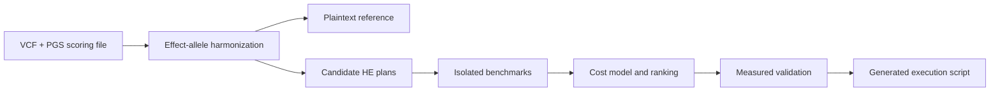

# AutoHE-PRS

**Constraint-aware execution-plan tuning for homomorphic polygenic risk-score computation.**

유전체 PRS 계산에 필요한 데이터 정합성·동형암호 파라미터·실행 비용을 함께 다루는 연구 프로토타입입니다.



## Main components

- VCF/GT/DS parsing, PGS-score harmonization, missing-data policy, and plaintext reference computation.
- CKKS/BFV/BGV plan validation, packing, candidate generation, and isolated OpenFHE benchmarks.
- Cost-model training, baseline search, ranking, Pareto analysis, and top-candidate verification.
- Reproducible plan/script emission and explicit separation of predictions from measured costs.

## Quick start

Python 3.10+.

```bash
python -m venv .venv
# Activate .venv using your operating system's command.
python -m pip install -e ".[data,ml,report,test]"
autohe-prs --help
python -m pytest tests/test_autohe_frontend.py tests/test_autohe_pipeline.py -q
```

Real encrypted benchmarks additionally require an OpenFHE environment; see `docker/autohe-openfhe/`. The frontend tests use small generated inputs. Public genomic datasets and model artifacts are obtained separately, not bundled.

## Evidence and scope

- [Experiment report](reports/autohe_smoke/EXPERIMENT_REPORT.md)
- [Measured historical results](docs/current_results.md)
- [Data sources](docs/data_sources.md)
- [Threat model](THREAT_MODEL.md) and [limitations](LIMITATIONS.md)

`src/autohe_prs/` is the autotuning pipeline. `src/genome_he_pilot/` preserves the measured pilot backends used by the research. Historical TenSEAL measurements are not relabelled as OpenFHE measurements, and a predicted fast plan is not claimed to be fast without measurement. The prototype is not a clinically validated risk predictor.

## Publication and validation

This is a curated research source snapshot, not the complete local experiment archive.
See [validation](VALIDATION.md), [publication scope](PUBLICATION_NOTES.md), and [credential handling](SECURITY.md).
