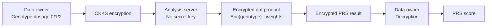
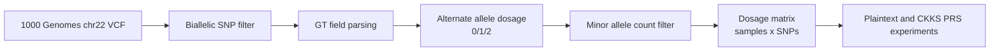
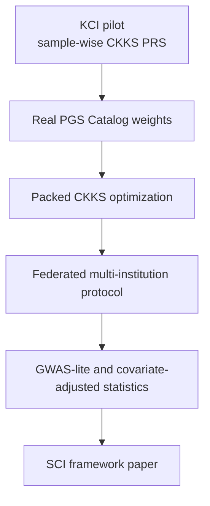

# Draft Figures

Rendered SVG files are available in:

```text
paper_assets/figures/
```

Generated files:

- `fig1_encrypted_prs_workflow.svg`
- `fig2_vcf_preprocessing.svg`
- `fig3_synthetic_ckks_scaling.svg`
- `fig4_real_cad_pgs_validation.svg`

## Figure 1. Privacy-Preserving PRS Workflow



Caption draft:

> Overview of the proposed privacy-preserving PRS computation workflow. The
> analysis server receives encrypted genotype dosage vectors and computes PRS
> without access to the secret key or raw genotype values.

## Figure 2. 1000 Genomes VCF Preprocessing



Caption draft:

> Preprocessing pipeline for public-data validation. Biallelic SNPs are selected
> from the chr22 VCF, genotype fields are converted to alternate allele dosage,
> and monomorphic variants in the selected cohort are filtered before PRS
> computation.

## Figure 3. KCI-to-SCI Extension Path



Caption draft:

> Planned extension path from the KCI pilot implementation to a scalable
> SCI-level privacy-preserving genomic analysis framework.
