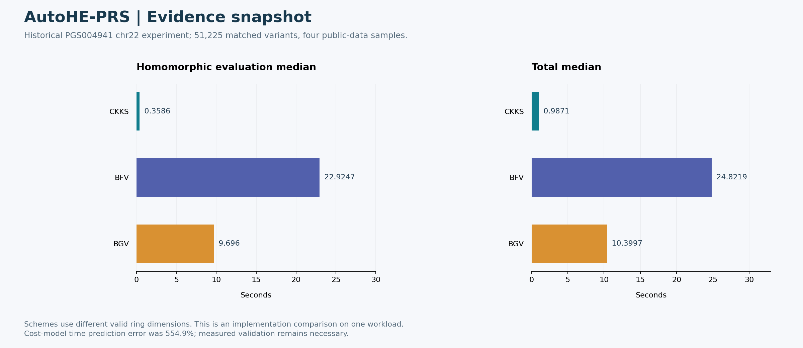

# AutoHE-PRS: 실험 결과와 진행 상태

이 문서는 공개본에 보존된 실험·검증 기록을 시각화한 것이다. 원래 학습·과학 실험을 새로 수행했다는 의미는 아니다. 기능 테스트, 합성 데모, 실제 성능 지표를 서로 구분한다. 진행률의 임의 퍼센트는 사용하지 않는다.



## 결과 해석

이 workload에서 CKKS evaluation median은 0.3586초였다. 다만 scheme별 유효 파라미터가 다르며 전반적인 scheme 우위를 뜻하지 않는다. 비용모델 예측 2.3486초와 실측 간 오차가 554.9%였으므로 순위화와 절대 시간 예측을 구분해야 한다.

## 현재 진행 상태

| 항목 | 확인된 상태 |
|---|---|
| 정합화·계획 탐색·검증 | 핵심 파이프라인 구현 |
| 실제 데이터 실험 | 기존 chr22·4표본 기록 보유 |
| 공개본 테스트 | 22개 통과, 선택 조건 5개 건너뜀 |
| 실제 backend 재실행 | 이번 공개 과정에서 미실행 |

## 다음 보완 과제

1. 다양한 표본·변이 수에서 비용모델 보정과 일반화 평가
2. 동일 budget의 baseline search 비교
3. 지원 환경에서 OpenFHE 전체 benchmark 재실행

## 보안 범위와 남은 검증

평가자는 semi-honest로 가정한다. 악의적 평가자, 키 탈취, threshold/collusion, 평문 결과의 DP 보호는 현재 범위 밖이며 timing·크기·공개 weight는 노출된다.
`.gitignore` 외에 공개 파일 내용도 검사했다. 이전에 유출된 비밀정보를 ignore 규칙만으로 회수할 수는 없다.

## 근거와 그림 재현

- [reports/autohe_smoke/EXPERIMENT_REPORT.md](../../reports/autohe_smoke/EXPERIMENT_REPORT.md)
- [THREAT_MODEL.md](../../THREAT_MODEL.md)
- [VALIDATION.md](../../VALIDATION.md)
- [그림의 수치와 조건](metrics.json)
- [확대 가능한 SVG](results.svg)
- [그림 재생성 코드](reproduce_figures.py)

```bash
python -m pip install matplotlib
python docs/portfolio-results/reproduce_figures.py
```

원시 실험 재현은 각 프로젝트의 본문 프로토콜을 따른다. 위 명령은 보존된 수치로 그림만 다시 만든다.
